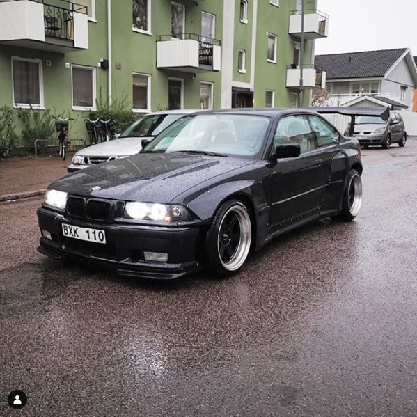
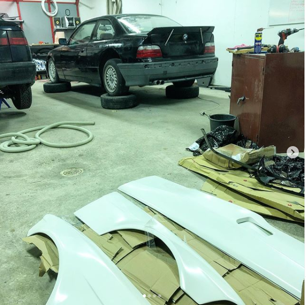
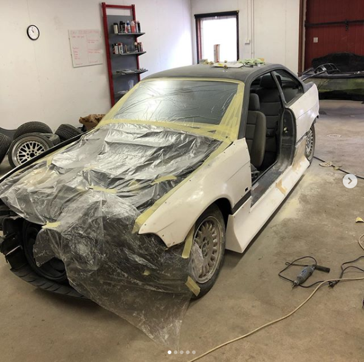
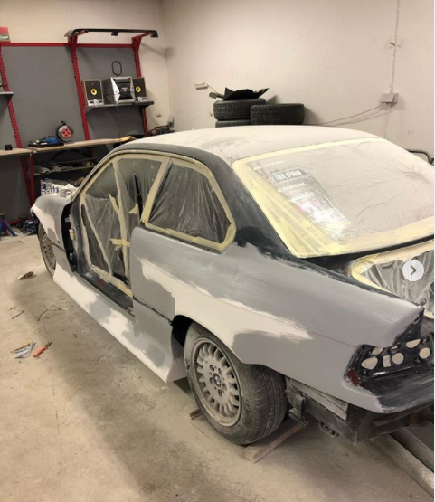
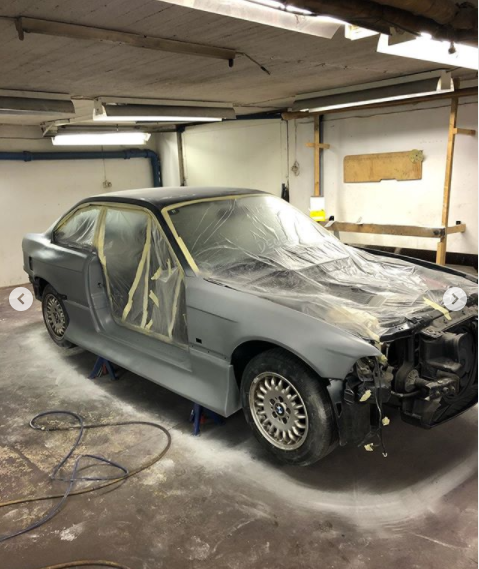
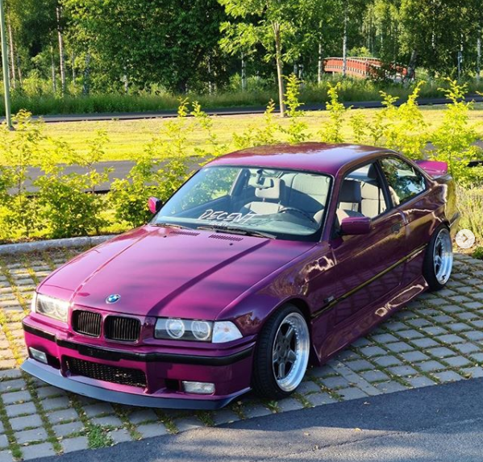

Dagen är kommen, den vi alla har väntat på så fruktansvärt länge! Albin har äntligen gjort klart sin
BMW E36 323 Cupé! Från oktober 2019 har den varit i garaget och renoverats. Han har lagat all rost och
även spacklat in ett Felony kit. Vad vi vet så är det det ända i Sverige som är inspacklat! Vi tycker att albins 
arbete är så sjukt inponerande av vad man kan göra i ett garage! Om vi har räknat rätt så är det
ca 1000h och 100 000kr som har lagts ner på bilen. Albin kommer att bruka bilen hela sommaren innan den ställs 
av i oktober igen för ytterligare genomgång av underrede eller inredning, har har inte bestämt sig än.
Här är lite för- och efterbilder på hans bil.

***

#### Här är innan han satt igång med renoveringen

***

#### Testa av kit och ducktails

***

#### Här var det dags för föreberedelser inför spackel

***

#### Spackling i full fart!

***

#### Här lägs grunden i ett garage!

***

#### Såhär ser den ut idag!

| Syntax    | Description | Type         | Style  | Another Column      |
| --------- | ----------- | ------------ | ------ | ------------------- |
| Header    | Title       | HTML Element | Simple | More Boring Info    |
| Header    | Title       | HTML Element | Simple | More Boring Info    |
| Header    | Title       | HTML Element | Simple | More Boring Info    |